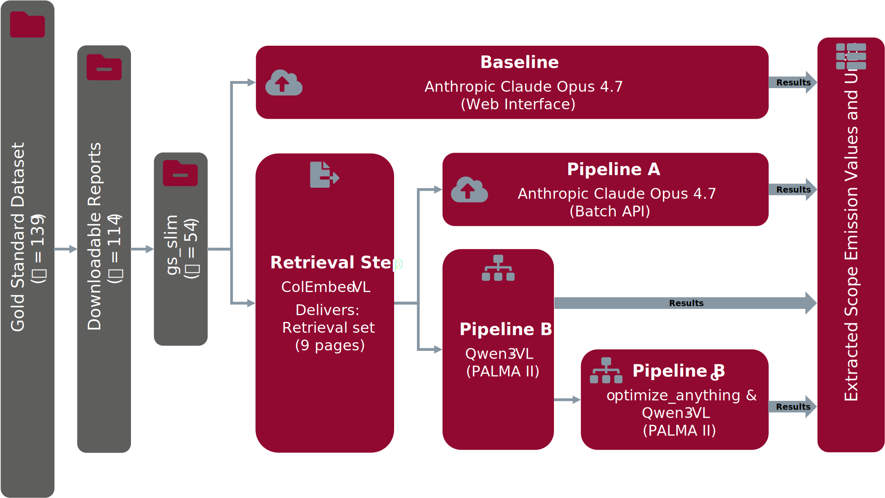

# Codebase: Bachelor Thesis "Beyond Text-Based RAG: Evaluating Visual RAG and Long Context for Automated GHG Emission Extraction from Sustainability Reports"

<p align="center">
  
  &nbsp;&nbsp;&nbsp;&nbsp;&nbsp;&nbsp;&nbsp;&nbsp;&nbsp;&nbsp;&nbsp;&nbsp;&nbsp;&nbsp;&nbsp;&nbsp;
  
</p>


The thesis compares four end-to-end approaches for extracting Scope 1–3 greenhouse gas emissions from corporate sustainability reports and evaluates them against a gold standard dataset. This repository holds the code for all four, the prompt-optimization, the SLURM scripts used on the PALMA II cluster, and the evaluation notebooks.

<p align="center">
  
</p>

---

## The Four Approaches

Modern frontier models have context windows large enough to hold an entire sustainability report, which raises the question whether a retrieval step is still needed at all. To test that, the **Baseline** hands the full report to a frontier model, representing the Long Context approach. **Pipeline A** keeps the same extractor but feeds it only up to 9 pages a visual retriever selected, isolating the effect of the page budget. **Pipeline B** replaces the extractor with an open-weight VLM that reads rendered page images, testing whether a vision-based model can compete. **Pipeline B_G** runs Pipeline B with a GEPA-optimized extraction prompt.

| | Baseline | Pipeline A | Pipeline B | Pipeline B_G |
| --- | --- | --- | --- | --- |
| Retrieval model | — | ColEmbed-8B | ColEmbed-8B | ColEmbed-8B |
| Page budget | all pages | ≤ 9 | ≤ 9 | ≤ 9 |
| Page representation | PDF | PDF | page images, 150 DPI | page images, 150 DPI |
| Extraction model | Claude Opus 4.7 | Claude Opus 4.7 | Qwen3-VL-32B-Thinking | Qwen3-VL-32B-Thinking |
| Extraction prompt | P_0 | P_0 | P_0 | P_GEPA |
| Execution environment | Web interface | Batch API | PALMA II (H200) | PALMA II (H200) |

Retrieval uses **Nemotron ColEmbed-VL 8B V2** with `TOP_K = 3`, expanded by the ±1 neighbour pages, which yields retrieval sets of 5–9 pages (mean 7.6) from reports averaging around 85 pages.

All four approaches should yield the same JSON schema, open for multiple vlaues per report-scope-year combination, as those exist in the gold-standrd dataset.

```json
{
  "report_name": "<filename without .pdf>",
  "report_title": "<full report title>",
  "emissions": {
    "scope_1":                { "<year>": [{ "value": 0, "unit": "", "label": "" }] },
    "scope_2_market_based":   { "<year>": [ ... ] },
    "scope_2_location_based": { "<year>": [ ... ] },
    "scope_3":                { "<year>": [ ... ] }
  }
}
```

---

## Results

### Retrieval
Retrieval over the 72 dataset (report, page) pairs: **Recall@3 = 91.67 %** on the top-3 pages alone, **100.00%** after the ±1 neighbor expansion.

### Extraction
Scored over the 54 reports of `gs_slim`. The evaluation grid has 2,208 report–scope–year cells, of which 489 carry a reported value and 1,719 are legitimately empty.

| Approach | Value recall (any) | Value recall (exact) | Reports fully correct (of 54) |
| --- | :---: | :---: | :---: |
| Baseline | 89.57 % | 86.09 % | 39 (72.2 %) |
| Pipeline A | 92.23 % | 90.59 % | 41 (75.9 %) |
| Pipeline B | 90.80 % | 86.50 % | 38 (70.4 %) |
| Pipeline B_G | **93.05 %** | 89.98 % | **44 (81.5 %)** |

The notebooks that produce them are listed under [Evaluation](#evaluation).

---

## Repository Structure

```
.
├── baselines/
│   └── baseline_frontier_model/
│       ├── Baseline-Prompt.txt    # P0 — extraction prompt used by 3/4 approaches
│       └── raw/                   # one Baseline JSON per report (54), hand-collected
├── localdata/                     # report PDFs, retrieval sets, retrieval logs
├── sh/                            # SLURM batch scripts (for PALMA II)
├── src/
│   ├── pipelines/
│   │   ├── pipelineA/             # A-01 … A-04 (Python Scripts for local and HPC use)
│   │   └── pipelineB/             # B-03 (embedding/retrieval reuse of Pipeline A)
│   ├── GEPA/                      # prompt optimization via optimize_anything
│   └── colpali-original.py        # reference script
├── evaluations/                   # gold standard, flattening, notebooks, results
├── requirements-HPC.txt           # pip freeze from the HPC venv
└── requirements-local.txt         # pip freeze from the local venv
```

---

## Setup

```bash
python -m venv .venv && source .venv/bin/activate
pip install -r requirements-local.txt      # on the cluster: requirements-HPC.txt
```

Both requirement files are `pip freeze` dumps of the environments actually used. The HPC one pins a prebuilt `flash_attn` wheel and CUDA 13 builds.

Secrets are read from a gitignored `.env` (`python-dotenv`):

```
ANTHROPIC_API_KEY=...     # Pipeline A (A-03/A-04)
OPENAI_API_KEY=...        # UniGPT endpoint (GEPA reflection LM)
OPENAI_API_BASE=...       # UniGPT API Key  (GEPA reflection LM)
```

> **Cluster paths are hardcoded.** The pipeline scripts read and write under `SCRATCH_ROOT = /scratch/tmp/jkuhlma1`, and the SLURM scripts assume the repository sits at `$HOME/2026_BA_Code`. Those are not global variables. Both must be adjusted before running anywhere else. Results committed to this repository were manually copied back from `SCRATCH_ROOT` into `localdata/`, `evaluations/` and `baselines/`.

---

## Reproducing the results

The steps below run in order. Every script takes `--help` for the flags.

**0 — Data.** The reports must be downloaded via the links given in the gold standard dataset. A copy of them can already be found under `localdata/esg_reports_all`.  `evaluations/gs_slimming.py` then builds `gs_slim.json` from `gold_standard.csv`, applying the corrections to known gold standard errors described in the thesis (§4.1.2).

**1 — Baseline.** Not reproducible from this repository: each report was uploaded by hand to the Claude web interface and the returned JSON was copied into `baselines/baseline_frontier_model/raw/`.

**2 — Embedding and retrieval** (shared by Pipeline A and B):

```bash
sbatch sh/A-01-embed.sh -8B        # page embeddings → one .pt per report + KPI log
sbatch sh/A-02-retrieval.sh -8B    # MaxSim scoring → mini-PDF per report + retrieval log
```

`A-01` renders pages with PyMuPDF at 150 DPI and runs ColEmbed 8B (`-8B`). `A-02` embeds the retrieval query Q_0 with the same model, scores every page, and writes the top-3 pages plus their ±1 neighbors as a mini-PDF. The model flag is required.

**3 — Pipeline A** (extraction via the Anthropic Batch API):

```bash
python src/pipelines/pipelineA/A-03-toClaude.py    # submit the batch
python src/pipelines/pipelineA/A-04-fromClaude.py  # poll, write one JSON + usage log per report
```

Three API conditions are available via `-c`: `bare`, `thinking`, and `thinking_system` (default). Each writes to its own output folder.

**4 — Pipeline B** (extraction with a local VLM):

```bash
sbatch sh/B-03-HPC.sh -m t         # dense Qwen3-VL-32B-Thinking
```

> `sbatch` schedules a job script on the HPC.

`-m` also accepts the MoE (`m`) and non-thinking Instruct (`i`) variants. The script renders the retrieval-set pages, runs the extraction prompt with a 16,384-token budget (can be modified with flags) and writes one JSON per report plus a results CSV with runtime and pages per report.

**5 — Prompt optimization** (produces Pipeline B_G):

```bash
sbatch sh/GEPA-01_H200.sh          # src/GEPA/oa_main.py
sbatch sh/B-03-HPC.sh -m t -p src/GEPA/oa_result.txt
```

`oa_main.py` seeds `gepa.optimize_anything` with P₀ and optimizes against the 60 % training split, using GPT-OSS 120B as the external reflection model via UniGPT (needs active internet connection). Per-iteration outputs land in `evaluations/GEPA_Prompt_Optimization/GEPA_runs/<run>/<iteration>/`. The split is seeded (`random.seed(42)`) and further divided by whether the unoptimized model already extracted a report correctly or not.

**6 — Evaluation.** Each comparison folder under `evaluations/` follows the same two-notebook pattern: `01-Prep-*.ipynb` flattens the extractions, joins them onto `gs_slim.json` and normalizes fiscal years into a `*_ynorm.json`; `02-Eval-*.ipynb` reads that file and computes the metrics. Notebook 01 must always run first.

Run the per-approach 01-notebooks first, before running any notebooks that compare different approaches like `evaluations/Baseline-PipelineA-PipelineB`.

---

## Evaluation

| Folder | Content |
| --- | --- |
| `baseline/`, `PipelineA/`, `PipelineB/` | per-approach preparation and evaluation |
| `Baseline-PipelineA/`, `Baseline-PipelineA-PipelineB/` | cross-approach comparisons |
| `GEPA_Prompt_Optimization/` | per-run preparation, run outputs, summaries |
| `A-01/` | embedding-model KPI comparison (3B/4B/8B), batch-size comparison |
| `A-02/` | retrieval evaluation against the gold standard pages |

Scripts for the thesis:
- `gs_pageCount.py` / `gs_slim_pageCount.py` together with `rScripts` (in Bachelor-Thesis Repo, not here!)
- `gepa_split_valuebearing.py` (training/held-out split analysis)
- `cost_analysis.py` (Cost analysis)

---

## Data

| Path | Content |
| --- | --- |
| `localdata/esg_reports_all/` | the 114 downloadable reports of the gold standard dataset |
| `localdata/esg_reports/` | the 54 reports with extractable emission values (`gs_slim`) |
| `localdata/A-02-retrievals/` | the 54 retrieval sets produced by A-02 (various models) |
| `localdata/A-02-retrievals/nvidia/nemotron-colembed-vl-8b-v2/` | the 54 retrieval sets used by all subsequent pipelines |
| `localdata/A-02-retrieval_log.csv`, `failed_urls.csv` | logs |

The report PDFs remain the property of the reporting companies.

---

## Dataset citation

The gold standard dataset was created by:

> Beck, J., Steinberg, A., Dimmelmeier, A., Domenech Burin, L., Kormanyos, E., Fehr, M., & Schierholz, M. (2025). Addressing data gaps in sustainability reporting: A benchmark dataset for greenhouse gas emission extraction. *Scientific Data*, 12(1), 1497. https://doi.org/10.1038/s41597-025-05664-8